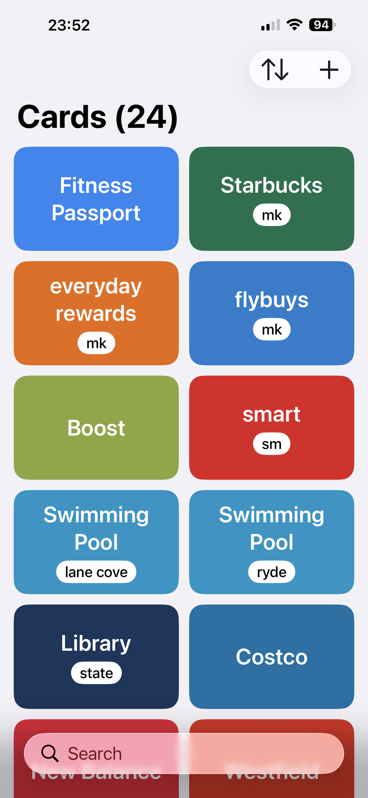

# Card List

A simple loyalty card wallet for iPhone.

Keep all your loyalty and membership cards in one place and show the barcode at the checkout.

## Features

- Add cards by scanning the barcode, typing the number, or importing screenshots
- Common barcode and QR code formats, detected automatically
- Syncs across your devices with iCloud
- Hold to brighten the screen for scanners
- No accounts, no ads, no tracking

## Free

Card List is completely free and will stay that way: no ads, no in-app purchases, no subscriptions.

## Availability

- iPhone only, iOS 26.6 or later. There are no plans for Android or other platforms.
- Australia only for now, with a built-in list of Australian stores.

## Privacy

Card List doesn't collect any data. See the [privacy policy](privacy-policy.md).

## Contact

email: minho42+cardlist@gmail.com
