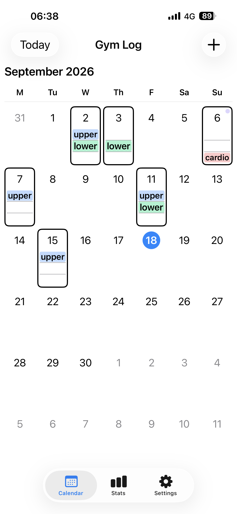
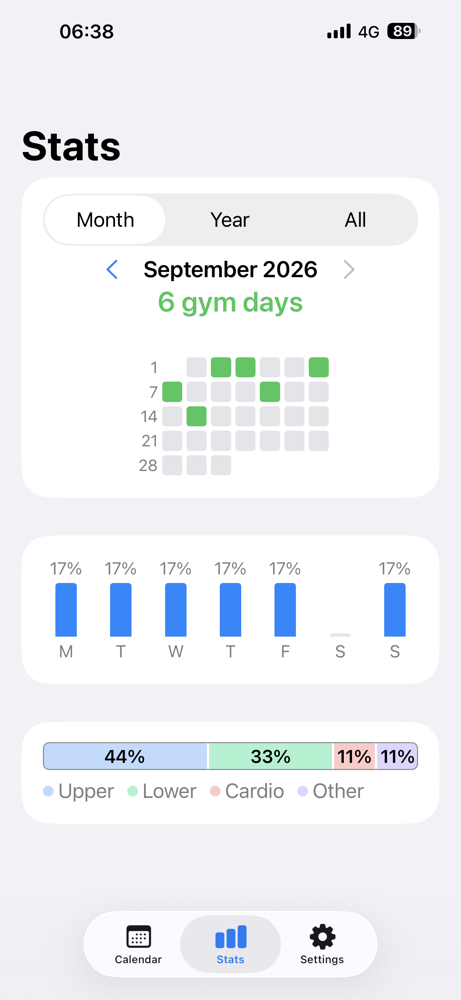

# Gym Log

A deliberately simple iOS app for tracking **whether you went to the gym** — not
reps or sets. Tap a day, mark what you did (upper, lower, cardio, or a general
check‑in), and see your consistency over time.

## Features

- Monthly calendar to log gym days at a glance.
- Stats: month heatmap, trends, weekly pattern, and category balance.
- Customizable category colors.
- Private iCloud sync across your devices.
- CSV export.

A one‑time **Pro** upgrade unlocks the full stats; the core logging is free.

## Privacy

Gym Log collects nothing — no ads, no analytics, no tracking. See the
[privacy policy](privacy-policy.md).

## Contact

**minho42+gymlog@gmail.com**
