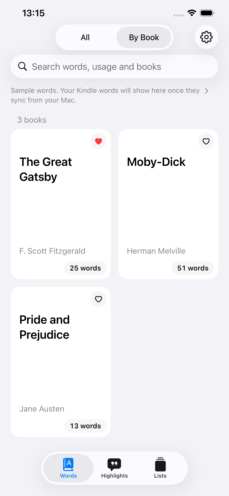
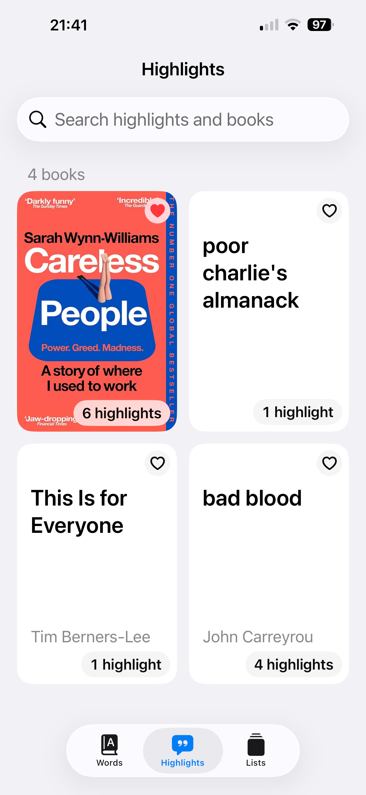

# Kindly Words

Learn the words you look up on your Kindle, in the sentences you found them in.

&nbsp;

## How it works

Kindly Words has two apps, and the Mac app comes first:

1. **On your Mac:** install Kindly Words Importer (free), plug your Kindle in over USB, and import.
   It reads your Kindle's looked-up words and highlights, and never changes anything on it.
2. **On your iPhone:** open Kindly Words. Your words and highlights arrive through your own
   iCloud, so sign in to the same iCloud account on both.

The iPhone app can't read a Kindle by itself. Until you import, it shows three sample books.
Import again whenever you've looked up new words.

## Which Kindles

Any Kindle with **Vocabulary Builder**, which saves the words you look up: the Kindle
Paperwhite from 2012 on, the basic Kindle from 2014 on, and every Voyage, Oasis, Scribe and
Colorsoft. Newer Kindles that don't show up in Finder work too.

Earlier Kindles, like the Kindle Keyboard, don't save looked-up words, but their highlights
can still be imported.

## Features

- Browse by book, with definitions and pronunciation.
- A word of the day, brought back from the ones you looked up a while ago.
- Your highlights, grouped by book.
- Search your words, the sentences you found them in, your books and your highlights.
- Kindly Words Pro, a one-time purchase, reads your words aloud with the sentences you
  found them in, and adds a word of the day widget for your Home and Lock Screen.

English only.

For a more natural voice, download a Premium or Enhanced voice in iPhone
Settings → Accessibility → Read & Speak → Voices → English.

[Privacy policy](privacy-policy.md)

## Support

Questions, bugs, or ideas: [minho42+kindlywords@gmail.com](mailto:minho42+kindlywords@gmail.com)
