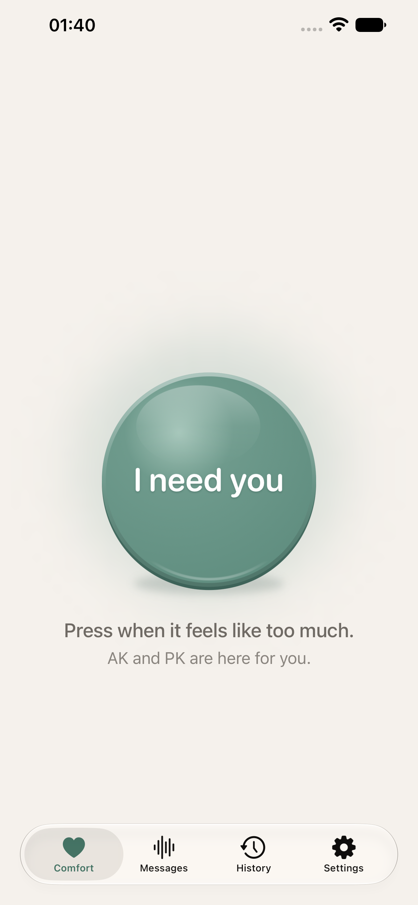
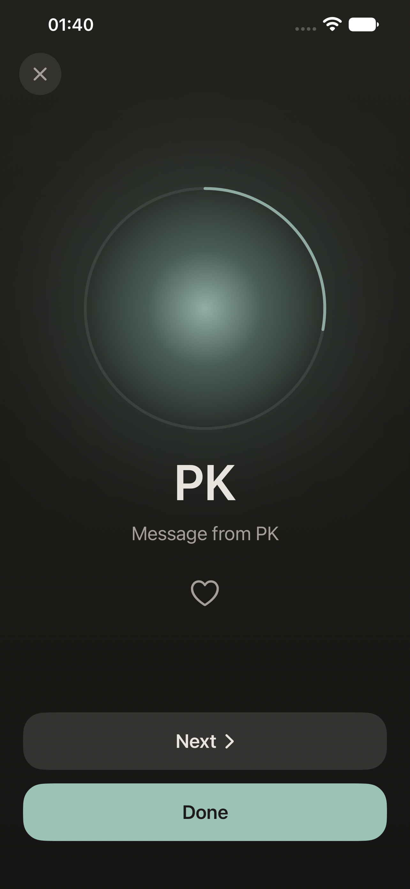

# Voice Support

An iPhone app for the moments when it all feels like too much. Save voice
messages from the people who love you, and when you need them, press one button
to hear them remind you that you're safe, you're loved, and this will pass.

&nbsp;

## Who it's for

Anyone going through a hard moment with their mental health, especially:

- **Anxiety** — anxiety or panic attacks, or feeling anxious and on edge.
- **Anger** — sudden surges of anger, or moments you're struggling to keep it
  under control.
- **Depression** — low moments when you feel alone or can't see a way through.

But whatever you're going through, if there are moments when it all feels like
too much, it's for you too. Hearing a familiar, caring voice can help you slow
down and get through it.

## How it works

- **One button** — the app opens straight to it. Press it and your messages
  start playing, one after another.
- **Messages** — record one yourself, bring in a voice memo or the sound from a
  video, or ask someone to send you one.
- **Likes** — the messages you like, and the ones that help most often, play
  first.
- **Check-in** — afterwards, say how you feel and which messages helped.
- **History** — a gentle look back at the hard moments you got through, and
  whose voices help you most.

## Privacy

Your messages and history stay on your iPhone and in its backup. There's no
server, no account to create, no analytics, and no ads. See the
[privacy policy](privacy-policy.md) for details.

## Not emergency help

Voice Support is a comfort tool, not a medical device or a substitute for
professional care. If you're in danger, or thinking about hurting yourself or
someone else, contact your local emergency number or a crisis line.

## Support

Questions, bugs, or ideas: [minho42+voicesupport@gmail.com](mailto:minho42+voicesupport@gmail.com)
